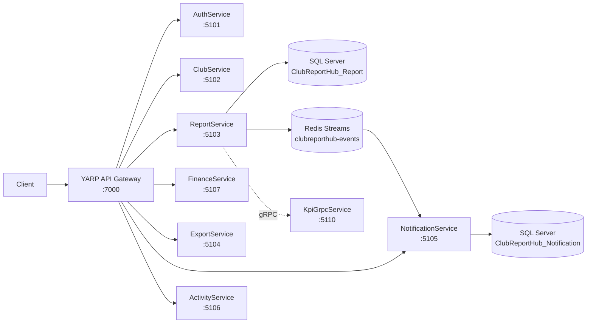

# ClubReportHub Backend

## Overview

ClubReportHub is a microservices-based backend for managing FPTU student club reports, activities, KPIs, and finances. Built with **.NET 8**, **Entity Framework Core**, **Redis Streams** (replacing RabbitMQ), and **gRPC**.

## Technology Stack

| Component | Technology |
|-----------|------------|
| API Gateway | YARP |
| Database | SQL Server 2022 + Entity Framework Core |
| Message Broker | **Redis Streams** (XADD/XREADGROUP) |
| gRPC | KpiGrpcService for KPI calculations |
| Background Jobs | Hangfire |
| Auth | JWT Bearer |
| Container | Docker + Docker Compose |

## Architecture



## Services

| Service | Port | Database | Description |
|---------|------|----------|-------------|
| API Gateway | 7000 | - | YARP reverse proxy |
| Auth | 5101 | Auth | Login, Register, JWT, Roles |
| Club | 5102 | Club | Clubs, Members, Applications |
| Activity | 5106 | Activity | Activities, Participants |
| Report | 5103 | Report | Reports, KPI, Deadlines |
| Finance | 5107 | Finance | Budget, Settlements |
| Export | 5104 | Export | PDF/Excel generation |
| Notification | 5105 | Notification | **Redis Streams consumer** |
| KpiGrpc | 5110 | - | **gRPC service** for KPI calculation |

## REST API

- `POST /api/auth/*` — Authentication
- `GET/POST /api/clubs/*` — Club management
- `GET/POST /api/activities/*` — Activity management
- `GET/POST /api/reports/*` — Report CRUD
- `POST /api/reports/{id}/submit` — **Submit report → SaveChanges → Redis XADD**
- `POST /api/reports/{id}/approve` — Approve report
- `POST /api/reports/{id}/reject` — Reject report
- `GET /api/kpis/leaderboard` — **REST → gRPC → KpiGrpcService → Response**
- `GET /api/kpis/rules` — KPI scoring rules
- `GET/POST /api/finance/*` — Financial management
- `GET /api/notifications/*` — Notifications
- `GET/POST /api/deadlines/*` — Reporting deadlines

## Redis Streams Architecture

### Stream

- **Stream name**: `clubreport-events` (configurable via `Redis:StreamName`)
- All events are appended via `XADD`
- Single stream, routing key stored as field

### Producer (RedisStreamEventBus)

```csharp
// ReportService/Program.cs
builder.Services.AddRedisStreamEventBus(builder.Configuration);

// Usage in workflow
await eventBus.PublishAsync(new ReportSubmittedEvent(...), EventRoutingKeys.ReportSubmitted, ct);
```

Fields per message:
- `eventId` (GUID)
- `eventType` (routing key)
- `occurredAtUtc` (ISO 8601)
- `schemaVersion`
- `payload` (JSON)
- `entityId`, `clubId` (optional, for correlation)

### Consumer (RedisStreamNotificationConsumer)

```csharp
// NotificationService/Program.cs
builder.Services.AddHostedService<RedisStreamNotificationConsumer>();
```

- Consumer group: `notification-service`
- Consumer name: `notification-consumer-{MachineName}-{ProcessId}`
- `XREADGROUP` with configurable batch size
- **Idempotency**: checks `ProcessedEvents` table before processing
- **XACK only after** `SaveChangesAsync` succeeds
- Duplicate events are skipped and acknowledged

### Events (13 total)

| Routing Key | Publisher | Consumer Action |
|------------|-----------|-----------------|
| `report.submitted` | ReportService | Create notification for club manager |
| `report.approved` | ReportService | Create notification for report creator |
| `report.rejected` | ReportService | Create notification with rejection reason |
| `club.created` | ClubService | Notify Student Affairs admin |
| `user.registered` | AuthService | Welcome notification |
| `activity.created` | ActivityService | Notify club members |
| `kpi.calculated` | ReportService | Notify club manager |
| `budget.proposal.submitted` | FinanceService | Notify Student Affairs admin |
| `budget.approved` | FinanceService | Notify proposal creator |
| `settlement.overdue` | FinanceService | Notify treasurer |
| `export.completed` | ExportService | Notify requester |
| `report.deadline.reminder` | ReportDeadlineJobs | Reminder notification |
| `export.requested` | ExportService | (outbound only) |

## gRPC Architecture

### KpiGrpcService

```
Protos/kpi.proto
├── CalculateLeaderboard (KpiLeaderboardRequest → KpiLeaderboardResponse)
└── CalculateClubKpi (KpiClubRequest → KpiClubResponse)
```

KPI Calculation Rules:
- **+50** per approved report
- **+5** per activity detail
- **+0.1** per participant
- **-10** per rejected report
- **-20** per overdue report
- Minimum score: **0**
- Rating categories: Excellent (≥500), Good (≥200), Average (≥50), Needs Improvement (<50)

### REST → gRPC Call Chain

```
GET /api/kpis/leaderboard
  → ReportService queries DB for metrics
  → For each club: grpcClient.CalculateClubKpi(request)
  → KpiGrpcService.CalculateClubKpi() returns score + rating
  → Fallback to local calculation if gRPC unavailable
  → Response includes gRPC-calculated scores
```

## Background Jobs (Hangfire)

| Job | Schedule | Description |
|-----|----------|-------------|
| `daily-submission-reminder` | Daily 8:00 | Publish deadline reminders via Redis |
| `monthly-missing-report-check` | 1st of month 8:30 | Check and report missing reports |

## Database Strategy

- Each service has its own SQL Server database
- `ProcessedEvents` table in Notification DB for idempotency
- `ReportingDeadlines` table in Report DB
- No cross-service DB dependencies
- EF Core migrations per service

## Configuration

### Redis

```json
"Redis": {
  "ConnectionString": "localhost:6379",
  "StreamName": "clubreporthub-events",
  "ConsumerGroup": "notification-service",
  "ConsumerNamePrefix": "notification-consumer",
  "BatchSize": 5,
  "PollIntervalMs": 1000
}
```

### gRPC Client

```json
"Services": {
  "KpiGrpcService": {
    "BaseUrl": "http://localhost:5110"
  }
}
```

In Docker: `http://kpi-grpc-service:8080`

## Installation

### Prerequisites

- .NET 8 SDK
- Docker & Docker Compose
- SQL Server 2022 (or Docker)

### Local Development

```bash
# Clone and restore
dotnet restore ClubReportHub.sln

# Run individual services
dotnet run --project src/Services/AuthService
dotnet run --project src/Services/ClubService
dotnet run --project src/Services/ReportService
dotnet run --project src/Services/KpiGrpcService
dotnet run --project src/Services/NotificationService
# ...

# Or run all tests
dotnet test ClubReportHub.sln
```

### Docker Deployment

```bash
# Copy and configure environment
cp .env.example .env
# Edit .env with your SQL_PASSWORD and JWT_SIGNING_KEY

# Start all services
docker compose up -d

# Verify all services are healthy
docker compose ps

# Check Redis
docker compose exec redis redis-cli ping
```

## Docker Services

```bash
# View logs
docker compose logs -f report-service notification-service

# Check Redis stream length
docker compose exec redis redis-cli XLEN clubreporthub-events

# View stream entries
docker compose exec redis redis-cli XRANGE clubreporthub-events - + COUNT 10

# Check pending messages (if any)
docker compose exec redis redis-cli XPENDING clubreporthub-events notification-service
```

## Migration: RabbitMQ → Redis Streams

RabbitMQ has been replaced by Redis Streams. The following files were removed:

- `src/Shared/ClubReportHub.Shared/Messaging/RabbitMqEventBus.cs`
- `src/Shared/ClubReportHub.Shared/Messaging/RabbitMqOptions.cs`
- `src/Shared/ClubReportHub.Shared/Messaging/RabbitMqServiceCollectionExtensions.cs`
- `src/Services/NotificationService/Consumers/RabbitMqNotificationConsumer.cs`

Replaced with:
- `src/Shared/ClubReportHub.Shared/Messaging/RedisStreamEventBus.cs`
- `src/Shared/ClubReportHub.Shared/Messaging/RedisStreamOptions.cs`
- `src/Shared/ClubReportHub.Shared/Messaging/RedisStreamServiceCollectionExtensions.cs`
- `src/Services/NotificationService/Consumers/RedisStreamNotificationConsumer.cs`

### Key Differences

| Aspect | RabbitMQ | Redis Streams |
|--------|---------|--------------|
| Delivery | Fan-out via exchange | Single stream, consumer groups |
| Acknowledgment | Manual BasicAck | XACK after SaveChanges |
| Idempotency | `ProcessedEvents` check | Same — unchanged |
| Configuration | `RabbitMQ:*` section | `Redis:*` section |

**Note**: Transactional Outbox pattern is **not yet implemented**. Current flow:
1. `SaveChangesAsync()` to database
2. `XADD` to Redis stream
3. If XADD fails → error is logged but database transaction already committed

## Troubleshooting

### Redis connection issues

```bash
# Check Redis is running
docker compose exec redis redis-cli ping
# Expected: PONG

# Check stream exists
docker compose exec redis redis-cli XRANGE clubreporthub-events - + COUNT 1
```

### Consumer not processing messages

```bash
# Check pending messages
docker compose exec redis redis-cli XPENDING clubreporthub-events notification-service

# Check consumer group exists
docker compose exec redis redis-cli XINFO GROUPS clubreporthub-events
```

### gRPC call fails

```bash
# Check KpiGrpcService is running
docker compose ps kpi-grpc-service

# Check gRPC health
curl http://localhost:5110/health
```

### SQL Server connection

```bash
# Check SQL Server health
docker compose ps sqlserver
docker compose logs sqlserver | grep -i "error"
```

## Team Responsibilities

> TODO: Fill in team member responsibilities

| Member | Responsibilities |
|---------|------------------|
| [Name] | Auth & Security |
| [Name] | Report & KPI Workflows |
| [Name] | Redis Streams & Notifications |
| [Name] | gRPC Services |
| [Name] | Docker & Infrastructure |
| [Name] | CI/CD & Testing |

## End-to-End Demo Checklist

### Part 1: Report Submission → Redis Stream → Notification

1. **Login**: `POST /api/auth/login` with admin credentials
2. **Create club** (if needed): `POST /api/clubs/`
3. **Create report**: `POST /api/reports/`
4. **Add details**: `PUT /api/reports/{id}/`
5. **Submit report**: `POST /api/reports/{id}/submit`
   - Log: `Published integration event {EventId} (report.submitted)`
6. **Check Redis stream**:
   ```bash
   docker compose logs -f report-service
   docker compose exec redis redis-cli XLEN clubreporthub-events
   docker compose exec redis redis-cli XRANGE clubreporthub-events - + COUNT 1
   ```
7. **Check notification consumer**:
   ```bash
   docker compose logs -f notification-service
   # Log: "Processed event {EventId} (report.submitted) -> Notification created"
   ```
8. **Query notifications**: `GET /api/notifications/?unreadOnly=true`

**Key log lines to verify**:
- Producer: `Published integration event {EventId} ({EventType}) to stream 'clubreporthub-events'`
- Consumer: `Processed event {EventId} ({EventType}) -> Notification created`

### Part 2: KPI via gRPC

1. **Submit and approve reports** for one or more clubs
2. **Call leaderboard**: `GET /api/kpis/leaderboard?period=2025-S2`
3. **Verify logs**:
   - ReportService: `REST calling gRPC CalculateClubKpi for ClubId: {ClubId}, CorrelationId: {CorrelationId}`
   - KpiGrpcService: `CalculateClubKpi RPC called. ClubId: {ClubId}, Period: '{Period}', CorrelationId: '{CorrelationId}'`
   - ReportService: `gRPC response received for ClubId: {ClubId}, Score: {Score}, Rating: '{Rating}'`
4. **Response** includes `Points` (from gRPC) and `Rating` field

### Part 3: Idempotency Verification

1. Submit a report
2. Check `XLEN` = 1
3. Restart notification service
4. Check `XLEN` still = 1 (message not re-processed)
5. Query notifications — only 1 notification created

## License

Internal use only — FPT University.
